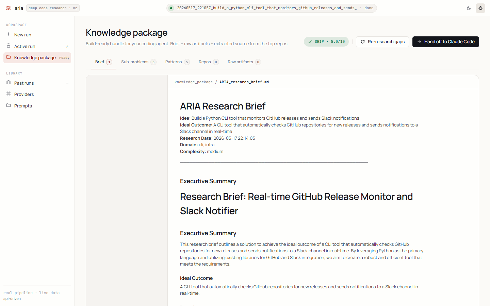

# ARIA v2 — Agentic Research Intelligence Architecture

**ARIA (Agentic Research Intelligence Architecture)** is an autonomous AI research system that takes a software idea and produces a comprehensive, structured knowledge package through deep multi-provider research. It combines GitHub code analysis, web research, architectural pattern extraction, and quality evaluation into a self-contained deliverable ready for AI coding tools or human developers.

[](https://www.python.org/downloads/)
[](LICENSE)

---

## ✨ Features

- **🧠 Multi-Agent Pipeline** — 8 specialized agents collaborate sequentially and in parallel to research, analyze, and synthesize
- **🔍 Deep GitHub Research** — Searches repos, scores relevance, deep-dives into top candidates, extracts patterns and code
- **🌐 Web Research** — DuckDuckGo searches + Jina Reader enrichment across technical docs, tutorials, and articles
- **🏗️ Pattern Extraction** — Identifies architectural patterns, libraries, anti-patterns, gotchas, and security considerations
- **📊 Quality Evaluation** — Scores the research brief across 4 dimensions with automatic re-research loops
- **📦 Knowledge Package Output** — Generates a structured folder with README, decomposition, patterns, libraries, build plan, and extracted code
- **🔧 Build Mode** — Extends research with deeper code extraction and auto-generates a starter project scaffold
- **🖥️ Live UI Dashboard** — Real-time React-based dashboard showing agent progress, sub-problem status, and logs
- **☁️ Multi-Provider LLM** — Supports Groq, DeepSeek, SambaNova, NVIDIA, Cerebras, SiliconFlow, Zhipu, Gemini, and Ollama
- **🔄 Resilience** — Circuit breakers, rate limiting, key rotation, and automatic fallback chains between providers

---

## 🚀 Quick Start

### Prerequisites

- Python 3.11+
- API keys for at least one provider (see [Configuration](#configuration))

### Installation

```bash
# Clone the repository
git clone https://github.com/chrisdev1187/Aria---GitHub-Research.git
cd Aria---GitHub-Research/aria

# Install dependencies
pip install -r requirements.txt

# Install system dependencies (Windows)
install_deps.bat
```

### Configuration

Copy the environment template and add your API keys:

```bash
cp .env.example .env
```

At minimum, you need one of these provider keys:

| Provider | Env Variable | Best For |
|----------|-------------|----------|
| Groq | `GROQ_API_KEY` | Intake, Decompose, Quality Judge |
| DeepSeek | `DEEPSEEK_API_KEY` | GitHub Research, Pattern Extraction |
| SiliconFlow | `SILICONFLOW_API_KEY` | Web Research |
| NVIDIA | `NVIDIA_API_KEY` | Synthesis |
| SambaNova | `SAMBANOVA_API_KEY` | Synthesis (fallback) |

You can also add multiple keys per provider (e.g., `GROQ_API_KEY`, `GROQ_API_KEY_2`) for load balancing.

### Run a Research Pipeline

```bash
# Basic research
python main.py run "Build a Python CLI tool that monitors GitHub releases and sends Slack notifications"

# Estimate costs before running (dry run)
python main.py run "Your idea" --dry-run

# Build mode (deeper extraction + project scaffold)
python main.py run "Your idea" --mode build

# Offline mode (uses local Ollama models)
python main.py run "Your idea" --offline

# Full deep research with Qwen 7B
python main.py run "Your idea" --deep
```

### Launch the Web UI

```bash
python main.py serve
# Opens at http://127.0.0.1:8080
```

---

## 🏗️ Architecture

ARIA is built as a modular, event-driven pipeline. Each agent is an independent module with a clear responsibility, communicating through a shared state system.

```
                    ┌─────────────┐
                    │   Intake    │  Idea → structured analysis
                    └──────┬──────┘
                           │
                    ┌──────▼──────┐
                    │  Decomposer  │  Break into 3-7 sub-problems
                    └──────┬──────┘
                           │
              ┌────────────┼────────────┐
              │            │            │
       ┌──────▼──────┐   ┌─▼──────────┐ │
       │  GitHub     │   │  Web       │ │  Parallel research
       │  Researcher │   │ Researcher  │ │  per sub-problem
       └──────┬──────┘   └──────┬──────┘ │
              │                 │        │
              └────────┬────────┘        │
                       │                 │
                ┌──────▼──────┐          │
                │   Pattern   │          │
                │  Extractor  │◄─────────┘
                └──────┬──────┘
                       │
                ┌──────▼──────┐
                │ Synthesizer  │  Research brief generation
                └──────┬──────┘
                       │
                ┌──────▼──────┐
                │  Quality    │  Score & verdict
                │   Judge     │  (≤2 re-research loops)
                └──────┬──────┘
                       │
                ┌──────▼──────────┐
                │  Knowledge      │  Structured package
                │   Packager      │  + optional scaffold
                └─────────────────┘
```

### [Full Architecture Documentation →](ARCHITECTURE.md)

---

## 🧩 Project Structure

```
aria/
├── main.py                  # CLI entry point + HTTP server
├── orchestrator.py          # Pipeline orchestration & checkpointing
├── state.py                 # ResearchState — checkpoint/recovery
├── config.py                # Provider configs, rate limits, models
├── provider_pool.py         # Multi-provider LLM pool with circuit breakers
├── requirements.txt         # Python dependencies
│
├── agents/
│   ├── intake.py            # Agent 1: Idea analysis
│   ├── decomposer.py        # Agent 2: Sub-problem decomposition
│   ├── github_researcher.py # Agent 3: GitHub repo research
│   ├── web_researcher.py    # Agent 4: Web research
│   ├── pattern_extractor.py # Agent 5: Pattern identification
│   ├── synthesizer.py       # Agent 6: Research brief synthesis
│   ├── quality_judge.py     # Agent 7: Quality evaluation
│   └── knowledge_packager.py# Agent 8: Final package generation
│
├── tools/
│   ├── groq_client.py       # Groq LLM client (with fallback chain)
│   ├── deepseek_client.py   # DeepSeek LLM client
│   ├── gemini_client.py     # Gemini LLM client
│   ├── nvidia_client.py     # NVIDIA NIM client
│   ├── sambanova_client.py  # SambaNova client
│   ├── cerebras_client.py   # Cerebras client
│   ├── siliconflow_client.py# SiliconFlow client
│   ├── zhipu_client.py      # Zhipu client
│   ├── ollama_client.py     # Local Ollama client
│   ├── github_api.py        # GitHub API wrapper
│   ├── ddg_search.py        # DuckDuckGo search
│   ├── jina_reader.py       # Jina Reader for web content
│   ├── code_extractor.py    # Code extraction from repos
│   ├── project_scaffolder.py# Build mode scaffold generator
│   ├── run_context.py       # Thread-safe UI state singleton
│   └── logger.py            # Rich-based logging
│
├── prompts/                 # LLM system prompts
│   ├── intake_system.txt
│   ├── decompose_system.txt
│   ├── github_research.txt
│   ├── web_research.txt
│   ├── pattern_extract.txt
│   ├── synthesize_system.txt
│   └── judge_system.txt
│
├── UI/                      # React-based dashboard
│   ├── index.html           # Entry point
│   ├── app.jsx              # Root component + state management
│   ├── screens.jsx          # IntakeScreen, PipelineScreen, PackageScreen
│   ├── swarm.jsx            # Agent swarm visualization
│   ├── data.js              # Data layer (API polling)
│   ├── styles.css           # Design system (oklch, light/dark)
│   └── tweaks-panel.jsx     # Theme & configuration panel
│
└── output/                  # Generated research packages
```

---

## 🧠 How It Works

### The Pipeline

1. **Intake** — Takes a raw idea and produces structured analysis: ideal outcome, domain classification, primary language, complexity estimate, and core technical problems.

2. **Decomposer** — Breaks the idea into 3-7 specific, searchable sub-problems with GitHub queries, StackOverflow tags, and relevance criteria.

3. **Research Phase** (parallel per sub-problem):
   - **GitHub Research** — Searches repos, batch-scores 20+ candidates, deep-dives top 3 for patterns, architecture, and code snippets
   - **Web Research** — Generates search queries, fetches tech articles via DuckDuckGo + Jina Reader, extracts structured insights

4. **Pattern Extractor** — Aggregates all findings into structured patterns: architectural approaches, libraries to use, repos to fork, anti-patterns, gotchas, performance, and security considerations.

5. **Synthesizer** — Produces a master research brief in markdown with executive summary, decomposition analysis, architecture decisions, and phased build plan.

6. **Quality Judge** — Scores the brief across 4 dimensions. If score < 5/10, triggers up to 2 re-research loops to fill gaps. Issues final verdict: SHIP, NEEDS_GAPS_FILLED, or RE_RESEARCH.

7. **Knowledge Packager** — Stitches all outputs into a self-contained `knowledge_package/` folder with README, problem statement, decomposition, top repos, patterns, libraries, build plan, web research, and risks. In build mode, also generates a starter project scaffold.

### Resilience

- **Circuit Breakers** — Each provider monitors failures; after 5 consecutive errors, the circuit opens for 60 seconds
- **Fallback Chains** — If a provider fails, the system cascades through backup providers automatically
- **Key Rotation** — Multiple API keys per provider are used in round-robin fashion
- **Rate Limiting** — Token bucket algorithm ensures requests stay within provider limits
- **Checkpoint/Recovery** — Every agent's output is persisted to disk; pipelines can resume from failure points

### Multi-Provider Strategy

| Agent | Primary Provider | Fallback Chain |
|-------|-----------------|----------------|
| Intake | Groq | Ollama (offline) |
| Decomposer | Groq | Cerebras → SiliconFlow → Zhipu |
| GitHub Researcher | DeepSeek | Groq → Zhipu |
| Web Researcher | SiliconFlow | — |
| Pattern Extractor | DeepSeek | Ollama (offline) |
| Synthesizer | NVIDIA | SambaNova → Groq → Zhipu |
| Quality Judge | Groq | Cerebras → SiliconFlow → Zhipu |
| Knowledge Packager | Groq | — |

---

## 🖼️ Dashboard Screenshots

<table>
  <tr>
    <th width="50%">Screen</th>
    <th width="50%">Description</th>
  </tr>
  <tr>
    <td><a href="docs/screenshots/01-intake-screen.png"></a></td>
    <td><strong>Intake</strong> — Enter your software idea and configure the research mode. Features idea input, mode selector (research/build), and theme toggle.</td>
  </tr>
  <tr>
    <td><a href="docs/screenshots/02-pipeline-screen.png"></a></td>
    <td><strong>Pipeline</strong> — Real-time agent progress with swarm visualization, sub-problem status cards, and live log stream.</td>
  </tr>
  <tr>
    <td><a href="docs/screenshots/03-package-screen.png"></a></td>
    <td><strong>Knowledge Package</strong> — Tabbed research results interface (Brief, Sub-problems, Patterns, Repos, Raw Artifacts).</td>
  </tr>
  <tr>
    <td><a href="docs/screenshots/04-brief-tab.png"></a></td>
    <td><strong>Brief Tab</strong> — Full research brief as rendered markdown with executive summary, architecture decisions, and build plan.</td>
  </tr>
  <tr>
    <td><a href="docs/screenshots/05-sub-problems-tab.png"></a></td>
    <td><strong>Sub-problems Tab</strong> — Per-problem research findings showing GitHub repos, web research, and extracted patterns.</td>
  </tr>
  <tr>
    <td><a href="docs/screenshots/06-settings-panel.png"></a></td>
    <td><strong>Settings Panel</strong> — Theme toggle (light/dark), active provider info, and research configuration parameters.</td>
  </tr>
</table>

> Each screenshot is annotated with callouts in the [Screenshot Guide](docs/screenshots/README.md).

---

## 🖥️ CLI Commands

```bash
# Run research pipeline
python main.py run <idea> [OPTIONS]

# Options:
  --dry-run         Estimate cost & runtime without executing
  --deep            Use deeper local models (Qwen 7B via Ollama)
  --offline         Privacy mode (Ollama only, no API calls)
  --resume          Resume from last checkpoint
  --focus TEXT      Narrow research to specific area
  --mode TEXT       'research' (default) or 'build'
  --ui              Open web UI after starting

# Check status
python main.py status

# List providers & rate limits
python main.py providers

# System health check
python main.py health

# Launch web UI
python main.py serve [--port PORT] [--no-open]
```

---

## 🔧 Configuration Reference

### Environment Variables

| Variable | Required | Description |
|----------|----------|-------------|
| `GROQ_API_KEY` | Partial | Groq inference |
| `DEEPSEEK_API_KEY` | Partial | DeepSeek inference |
| `SILICONFLOW_API_KEY` | Partial | SiliconFlow inference |
| `NVIDIA_API_KEY` | Optional | NVIDIA NIM inference |
| `SAMBANOVA_API_KEY` | Optional | SambaNova inference |
| `CEREBRAS_API_KEY` | Optional | Cerebras inference |
| `ZHIPU_API_KEY` | Optional | Zhipu inference |
| `GEMINI_API_KEY` | Optional | Google Gemini |
| `GITHUB_TOKEN` | Optional | GitHub API (5000 req/hr vs 60) |
| `JINA_API_KEY` | Optional | Jina Reader |

### Research Configuration (via env)

| Variable | Default | Description |
|----------|---------|-------------|
| `MAX_REPOS` | 15 | Max repos to analyze per sub-problem |
| `MAX_SUB_PROBLEMS` | 7 | Max sub-problems per idea |
| `MAX_STEPS_PER_AGENT` | 10 | Max LLM calls per agent |

---

## 🧪 Development

```bash
# Install dev dependencies
pip install -r requirements.txt

# Run a quick test pipeline
python main.py run "Build a simple CLI tool" --dry-run

# Run with concrete idea (requires API keys)
python main.py run "Build a Python CLI tool that monitors GitHub releases" --mode research

# Launch UI for live monitoring
python main.py serve --port 8080
```

---

## 📝 License

This project is licensed under the MIT License — see the [LICENSE](LICENSE) file for details.

---

## 🙏 Acknowledgements

- Built with [Rich](https://github.com/Textualize/rich) for beautiful terminal output
- LLM providers: Groq, DeepSeek, NVIDIA, SambaNova, and more
- React 18 for the live dashboard
- All open-source repos analyzed during research
