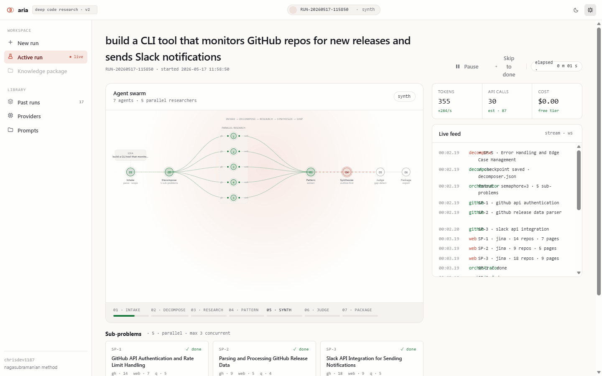
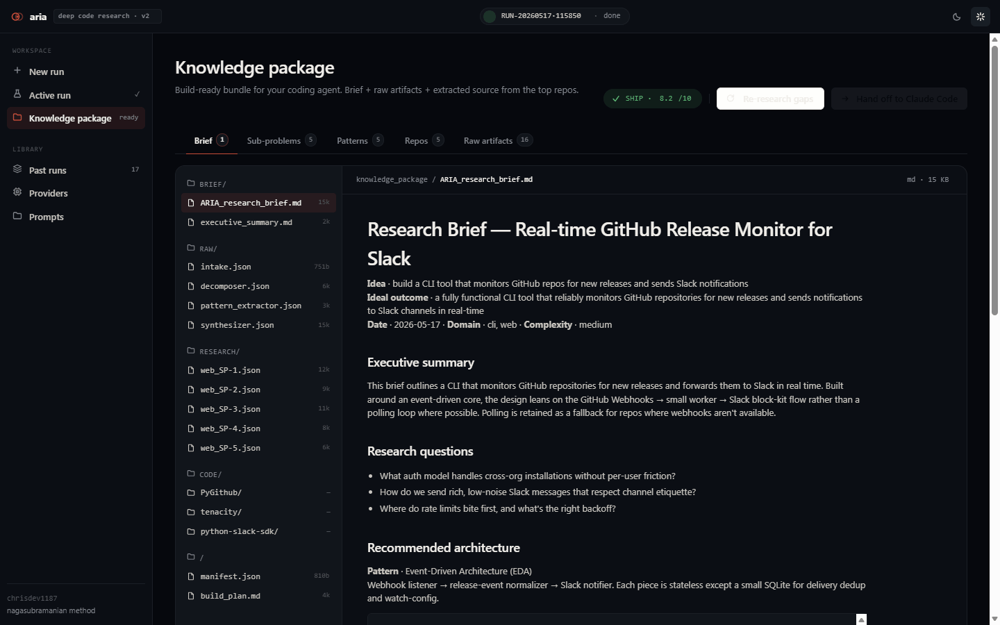

# ARIA v2

**Agentic Research Intelligence Architecture** — deep code research system.

Describe a build idea in plain English. ARIA decomposes it, fans 7 agents across GitHub + the web in parallel, and produces a build-ready research brief.





---

## Quickstart

```bash
# 1. Add API keys
cp .env.example .env   # fill in at least GROQ_API_KEY_1

# 2. Install
pip install -r requirements.txt

# 3. Run CLI
python main.py "build a CLI tool that monitors GitHub repos for new releases"

# 4. Or launch the UI
python main.py serve
# open http://localhost:7842
```

Output lands in `output/<run_id>/knowledge_package/`. Feed `06_BUILD_PLAN.md` to a coding agent to start building.

---

## Docs

| | |
|---|---|
| [Architecture](docs/ARCHITECTURE.md) | Pipeline, agents, provider pool, output format |
| [Providers](docs/PROVIDERS.md) | API key setup, .env template, status indicators |
| [Dev Log](docs/DEV_LOG.md) | Change history by session |
| [Research Notes](docs/NOTES.md) | Reference repos studied during design (gpt-researcher, STORM, deep-research) |

---

*By chrisdev1187 · Nagasubramanian Methodology*
